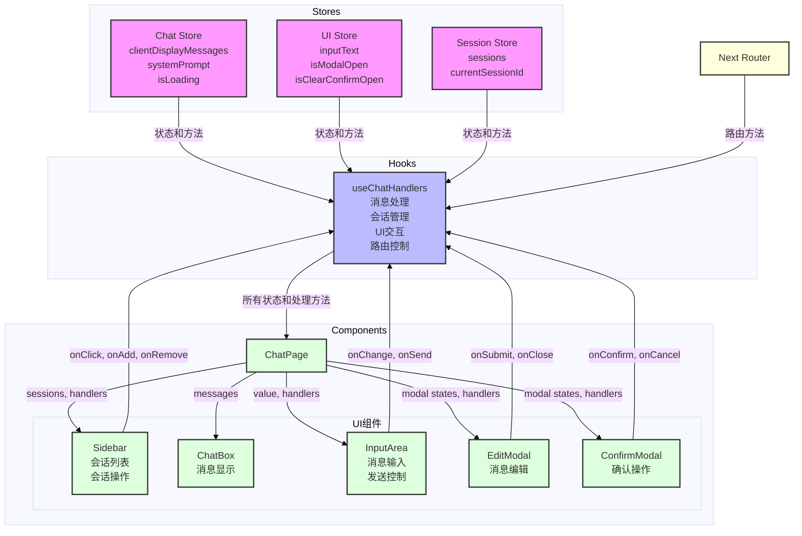

# Milestone 0.5.0 - Sidebar功能开发

## 基本信息
* Milestone版本: 0.5.0-dev
* 分支名称: feature/sidebar
* 开始日期: 2025-01-28
* 预计完成日期: 2025-02-03
* 状态: 进行中

## 目标概述
### 主要目标
- [x] 实现可折叠的侧边栏组件
- [ ] 集成会话管理功能
- [ ] 优化移动端适配
- [ ] 实现会话页面路由

### 功能范围
#### 侧边栏基础功能
- [x] 可折叠/展开
- [x] 响应式布局支持
- [x] 键盘快捷键支持

#### 会话管理
- [x] 会话列表显示
- [x] 会话切换功能
- [x] 新建会话功能
- [ ] 会话页面路由
  * [ ] 动态路由实现
  * [ ] 页面间平滑切换
  * [ ] 路由状态同步

#### 移动端优化
- [x] 抽屉式侧边栏
- [x] 触摸手势支持

## 开发日志
### 2025-01-28
#### 完成的工作
* 创建基础sidebar组件结构
* 实现sidebar的基础UI框架

#### 技术决策
* 使用shadcn/ui的组件库作为基础
* 实现响应式设计，移动端使用抽屉式侧边栏
* 使用Next.js App Router实现会话页面路由
  * 采用动态路由 `/chat/[sessionId]` 结构
  * 使用 `useRouter` hook进行路由控制
  * 实现路由加载状态处理

#### 遇到的问题

### 2025-01-29
#### 完成的工作
* [x] 实现基础会话列表组件
* [x] 完成新建会话功能
* [x] 实现基础会话状态管理
* [x] 完成Sidebar基础交互
  * 折叠/展开动画
  * 会话切换功能
  * 移动端手势支持
- [x] 实现会话删除功能
- [x] 完成会话状态管理与Zustand集成

#### 技术决策
##### 采用渐进式开发策略
- [x] 第一阶段：使用内存Map存储会话数据
- [x] 第二阶段：完善Sidebar基础功能
- [ ] 第三阶段：实现页面路由和数据持久化

##### 新增功能实现细节
* 会话删除后自动创建默认会话
* 统一使用clientDisplayMessages作为消息状态标识
* 优化会话管理组件的UI交互
* 添加会话重命名功能入口

##### 暂时搁置的功能
* 批量操作功能
* 会话数量限制
* 数据预加载
* 性能优化

### 2024-01-30
#### 完成的工作
* [x] 重构消息状态管理
  * 统一使用clientDisplayMessages
  * 优化消息同步逻辑
* [x] 完善会话管理功能
  * 实现会话删除保护机制
  * 添加默认会话自动创建
* [x] UI交互优化
  * 更新会话操作下拉菜单
  * 优化移动端布局

#### 待解决问题
* 会话重命名功能实现
* 路由系统集成
* 数据持久化方案

### 2025-01-31
#### 完成的工作
* [x] 实现动态路由系统
  * 创建 `/chat/[sessionId]` 动态路由页面
  * 实现基于路由参数的会话加载
  * 复用现有组件和状态管理逻辑
* [x] 优化会话切换机制
  * 添加路由参数监听
  * 实现会话自动加载
  * 保持UI状态同步

#### 技术决策
##### 动态路由实现方案
* 使用Next.js App Router的动态路由功能
* 采用`useParams` hook获取路由参数
* 通过`useEffect`监听路由变化并加载对应会话
* 复用现有的`useChatHandlers` hook保持状态管理一致性

##### 代码组织优化
* 将页面组件逻辑从`page.tsx`迁移到`[sessionId]/page.tsx`
* 保持组件结构和样式的一致性
* 通过props和hooks实现状态共享

#### 遇到的问题
* 路由参数变化时需要确保会话状态正确加载
* 需要处理无效sessionId的情况
* 会话切换时的状态同步需要优化

### 2025-02-01
#### 完成的工作
* [x] 优化会话状态管理
  * 重构`useChatHandlers`中的会话切换逻辑
  * 添加会话切换防抖处理
  * 优化会话状态保存机制
* [x] 完善路由系统集成
  * 实现根路由到默认会话的自动跳转
  * 优化会话ID的生成和管理
  * 添加默认系统消息
* [x] 重构组件通信
  * 完善Sidebar组件的props接口
  * 优化SessionItem的点击事件处理
  * 规范化组件间的数据流

#### 技术决策
##### 状态管理优化
* 在会话切换时保存前一个会话的状态
* 使用Map数据结构存储会话数据
* 添加会话操作的日志记录

##### 路由重定向策略
* 根路由自动重定向到第一个可用会话
* 无会话时自动创建默认会话
* 保持路由状态与会话状态同步

#### 遇到的问题
1. 会话切换时的状态不同步问题
- 点击会话A时，currentSessionId 还是会话B
- URL 变化触发 useEffect，导致重复调用 handleSessionClick
- 整个过程中 URL 显示不变

2. 问题的根本原因
- 状态更新（setCurrentSessionId）是异步的
- router.push 触发路由变化也是异步的
- useEffect 的依赖项包含了 sessionId 和 currentSessionId，导致重复触发

## 待办事项
### 第一优先级
- [x] 完善Sidebar基础交互
  * 折叠/展开动画
  * 会话切换功能
  * 移动端手势支持
  * 会话重命名
- [x] 实现会话路由系统
  * 创建动态路由页面
  * 路由状态管理
  * 路由切换动画

### 第二优先级
- [ ] 实现会话状态持久化
  * localStorage存储方案设计
  * 会话数据同步机制
- [ ] Session切换状态管理
  * 会话切换时消息状态同步
  * 会话后台加载状态管理

### 第三优先级
- [ ] 性能优化
  * 大量会话渲染优化
  * 历史消息懒加载
  * 动画性能优化

## 待讨论事项
* 会话数据的本地存储方案
* 会话状态管理的最佳实践
* 路由切换时的数据持久化策略
* 多会话并发加载的性能优化

### 已知问题
* 会话切换时消息状态同步需要优化
* 会话删除后的状态更新逻辑需要完善
* 移动端下拉菜单交互需要优化
* 需要添加会话操作的错误处理和用户反馈

## 相关资源
### 参考文档
* [Shadcn UI Sidebar组件文档](https://ui.shadcn.com/)
* [Next.js布局文档](https://nextjs.org/docs/app/building-your-application/routing/pages-and-layouts)
* [Next.js动态路由文档](https://nextjs.org/docs/app/building-your-application/routing/dynamic-routes)
* [Next.js导航和路由](https://nextjs.org/docs/app/building-your-application/routing/linking-and-navigating)

### 设计文档
* 项目PRD文档：docs/prd.md
* 技术方案：docs/learn/streaming-chat-client-refactoring.md

### API文档
* 会话管理API（待开发）
* 路由相关API
  * 会话列表获取
  * 会话详情获取
  * 会话状态同步

## 注意事项
* 确保所有UI组件都遵循项目的设计规范
* 保持代码的TypeScript类型安全
* 注意性能优化，特别是在动画和状态管理方面
* 路由切换时注意：
  * 数据预加载
  * 状态持久化
  * 平滑过渡
  * SEO优化

## 总结
### 经验总结
* shadcn/ui的Sidebar组件提供了良好的基础，但需要针对移动端做额外适配
* Zustand状态管理在会话管理场景下表现良好，特别是状态更新和共享
* 需要在早期就考虑会话数据的持久化方案
* 组件间的状态同步需要仔细设计，避免不必要的重渲染

### 改进建议
* 考虑使用React Query优化数据获取和缓存
* 实现会话数据的批量操作和导出功能
* 添加会话操作的撤销/重做功能
* 优化移动端的触摸手势体验
* 实现会话数据的定期自动保存
* 添加会话操作的快捷键支持

### 下一步计划
* 完成会话重命名功能
* 实现会话数据的持久化
* 集成动态路由系统
* 优化移动端交互体验

## props和state流向

